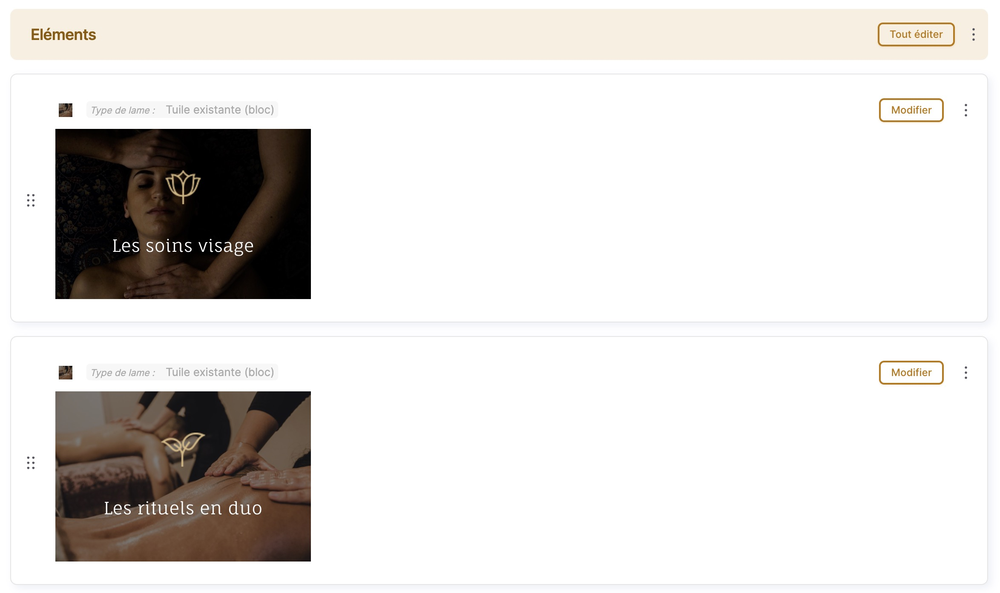

Renders paragraph preview in closed mode using the frontend theme inside an iframe

## Problem

When editing a node, paragraphs can be collapsed — either by default or by clicking the **Collapse** button.

In the *Form display* settings of a paragraphs field, you can choose what should be shown when a paragraph is collapsed:

* a summary
* or a preview

When the **Preview** option is selected, the preview is rendered using the **admin theme**.
As a result, the preview does not accurately reflect how the paragraph will look on the frontend.

---

## Solution

The goal of this module is to render paragraph previews using the **frontend theme**, so the preview is as faithful as possible to the final output.


To achieve this, the paragraph preview is rendered inside an **iframe**.

The module also supports nested paragraphs.



---

## Necessary adjustments

For an optimal user experience, and to make the preview look as close as possible to the final result, you may need to make a few adjustments to your CSS and JavaScript, and reconsider where you attach your libraries.

### CSS selectors relying on parent containers

Let’s take the example of a **block** that displays multiple tiles side by side. All `.tile` elements will typically be wrapped in a container such as `#tiles`.

In the paragraph preview context of a single tile, this container does **not** exist. As a result:

* Any SCSS written like this will **not apply**:

```scss
#tiles {
  .tile {
    /* ... */
  }
}
```

### JavaScript relying on parent containers

* Any JavaScript relying on the parent container will also **not be triggered**:

```js
once('shuffle-tiles', '#tiles', context).forEach(container => {
  shuffleTiles();
});
```

### Library attachment location

If your CSS or JavaScript libraries are attached at the container level — the block in this example — they will not be attached in the context of a single tile preview.

In such cases, you may need to attach your libraries:

* at the tile level
* or globally (with proper scoping)

### iframe-specific styling

You may also want to add CSS rules that specifically apply to the iframe preview context.

The `<body>` inside the iframe has the `.path-paragraph-iframe-preview` class.

For example, you could define a `max-width` for paragraphs that are normally rendered inline alongside others and are not intended to span the full width:

```scss
body.path-paragraph-iframe-preview {
  .paragraph--type--tile {
    max-width: 300px;
  }
}
```

### Adjusting the iframe height

By default, the iframe height is set to **500px**, but this can be adjusted per paragraph bundle.

The iframe is wrapped in a container with the `.paragraph-iframe-preview` class, along with the paragraph bundle name. For example:

```css
.paragraph-iframe-preview.tile iframe {
  height: 200px;
}
```

⚠️ **Important:** this styling must be done from your **admin theme’s CSS**, since the frontend theme only applies inside the iframe.

---

## Under the hood

### Overriding the paragraph preview template

The module overrides `paragraph--preview.html.twig` to render the paragraph inside an iframe.

---

### Handling unsaved paragraphs

When a node has not been saved yet, the paragraph entity does not exist in the database. However, the iframe preview must still work when collapsing a paragraph during node creation or editing.

For this reason, the paragraph cannot be rendered from an entity ID inside the iframe.

To solve this, the paragraph entity is temporarily stored using the same mechanism as Drupal’s node preview system, via `PrivateTempStoreFactory`, which relies on the `key_value_expire` table:

* **collection:** `tempstore.private.paragraph_preview`
* **storage key:** the paragraph **UUID** (since the paragraph may not have an ID yet)

The temporary storage is handled in `template_preprocess_paragraph__preview()`.

---

### Rendering the iframe preview

Inside the iframe, a custom route is called: `paragraphs_iframe_preview.paragraph_iframe_preview`, handled by `ParagraphsIframePreviewController::paragraphIframePreview()`.

In this controller:

* the paragraph data is retrieved from `PrivateTempStoreFactory`
* the paragraph is rendered using `TwigEnvironment::renderInline()`

This ensures the paragraph is rendered exactly as it would be on the frontend.

---

### Minimal page rendering for the iframe

Because the iframe renders a full page, the site’s header and footer are not needed for the paragraph preview.

In `template_preprocess_html()`, the following elements are removed:

* `page_top`
* `page_bottom`
* unnecessary `body` attributes and classes

A dedicated page template is also provided:

* `page--paragraph-iframe-preview.html.twig`

This template only renders:

```twig
{{ page.content }}
```

This results in a clean, lightweight preview focused solely on the paragraph content.

## Requirements

- [Paragraphs](https://www.drupal.org/project/paragraphs)

## Installation

Install as you would normally install a contributed Drupal module. For further
information, see
[Installing Drupal Modules](https://www.drupal.org/docs/extending-drupal/installing-drupal-modules).

## Configuration

- In the form display settings of the paragraph field, set "closed mode" to "Preview", not "Summary".
- For an even better experience, set "default edit mode" to "Closed" so that the preview is displayed by default.

## Maintainers
- [Nicolas Bouteille](https://www.drupal.org/u/nicolas-bouteille)
